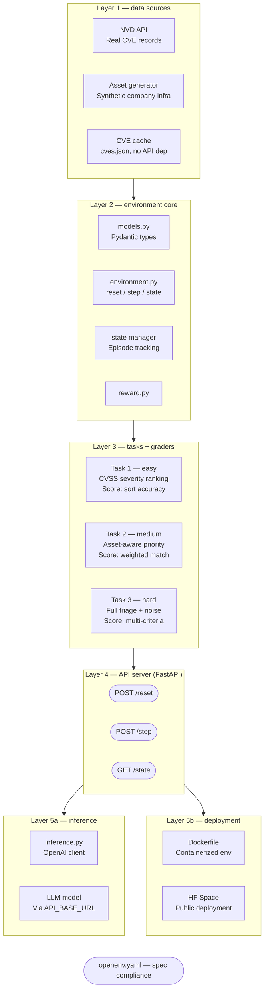

# 🔐 Security Vulnerability Triage — OpenEnv

An OpenEnv environment where an AI agent triages real-world CVEs across a simulated company's asset inventory.

Please refer to [setup.md](setup.md) for comprehensive setup and running instructions.

---

## 📖 What is it?
Every piece of software has bugs. Some bugs are harmless, some can be exploited by hackers to steal data, crash systems, or take control of servers. These exploitable bugs are called **vulnerabilities**, and they get published publicly as CVEs (Common Vulnerabilities and Exposures) — basically a global registry of known security holes.

The problem? A large company gets **hundreds of new CVEs every week** across all their software. They can't patch everything at once. Someone — or something — needs to **read each vulnerability, understand the context, and decide what to patch first.**

That job is called **Vulnerability Triage**, and it's currently done by exhausted security analysts staring at dashboards all day.

### How does it work in real life?
A security analyst looks at each CVE and asks:
- How severe is this? (CVSS score 0–10)
- Is there a known exploit in the wild already?
- Which of our systems are affected?
- How critical is that system to the business?
- Is there a patch available right now?

Then they assign a priority — **patch immediately / patch this week / monitor / ignore** — and move on to the next one.

### What your AI agent will do
The agent receives a **vulnerability report** (CVE details + a simulated company's asset inventory) and must triage it correctly — prioritizing the right vulnerabilities, ignoring low-risk noise, and acting fast on critical threats.

---

## 🗂️ The 3 Tasks

### 🟢 Task 1 — Basic Severity Ranking (Easy)
**Scenario:** Agent gets 10 CVEs with CVSS scores and must rank them from most to least critical.
**What makes it easy:** CVSS score is a direct number. Higher = worse. Straightforward sorting with some nuance around score bands.
**Grader:** Compare agent's ranking against ground truth ranking. Score = % of correct orderings.

### 🟡 Task 2 — Asset-Aware Prioritization (Medium)
**Scenario:** Agent gets 10 CVEs + a company asset inventory (which servers run which software, how business-critical each is). Must now prioritize considering both vulnerability severity AND asset importance.
**What makes it medium:** A CVSS 6.0 on your payment server beats a CVSS 8.0 on a dev sandbox. Agent must reason across two dimensions.
**Grader:** Weighted scoring — correct severity reasoning + correct asset matching = full score. Partial credit for getting one right.

### 🔴 Task 3 — Full Triage Under Noise (Hard)
**Scenario:** Agent gets 20 CVEs, asset inventory, patch availability info, and some red herrings — duplicate CVEs, outdated advisories, vendor disputes about severity. Must produce a final prioritized patch plan with justifications.
**What makes it hard:** Conflicting signals, irrelevant noise, limited patch resources (can only patch 5 this week), and must justify decisions.
**Grader:** Multi-criteria — correct top-5 selection + noise filtering + quality of justification reasoning.

---

## 📁 Project Structure

Here's the complete file layout:

```text
security-triage-env/
│
├── 📄 Dockerfile
├── 📄 README.md
├── 📄 setup.md                      ← setup guide and CLI instructions
├── 📄 openenv.yaml
├── 📄 inference.py                  ← baseline script (required by hackathon)
├── 📄 requirements.txt
│
├── env/                             ← core environment package
│   ├── __init__.py
│   ├── environment.py               ← main env class (reset/step/state)
│   ├── models.py                    ← Pydantic models (Observation, Action, Reward)
│   ├── reward.py                    ← reward calculation logic
│   └── state_manager.py             ← tracks episode state cleanly
│
├── data/
│   ├── nvd_fetcher.py               ← pulls CVEs from NVD API
│   ├── asset_generator.py           ← generates synthetic company assets
│   └── cache/                       ← cached CVE data (avoid API hammering)
│       └── cves.json
│
├── tasks/
│   ├── __init__.py
│   ├── task1_severity_ranking.py    ← easy task + grader
│   ├── task2_asset_prioritization.py ← medium task + grader
│   └── task3_full_triage.py         ← hard task + grader
│
├── api/
│   ├── __init__.py
│   └── server.py                    ← FastAPI server exposing the env
│
└── tests/
    ├── test_environment.py
    ├── test_graders.py
    └── test_models.py
```

---

## 📄 What Each File Does

### Root Level
| File | Purpose |
|---|---|
| `Dockerfile` | Containerizes everything, hackathon requirement |
| `openenv.yaml` | OpenEnv spec metadata, must pass `openenv validate` |
| `setup.md` | Contains the instructions for installation and setup locally |
| `inference.py` | Runs LLM agent against all 3 tasks, produces scores |
| `requirements.txt` | All Python dependencies |

### `env/` — The Brain
| File | Purpose |
|---|---|
| `environment.py` | Master class — wires reset/step/state together |
| `models.py` | All Pydantic typed models — this is your OpenEnv spec compliance |
| `reward.py` | Isolated reward logic — partial credit calculations |
| `state_manager.py` | Cleanly tracks what's happened in the episode so far |

### `data/` — The Fuel
| File | Purpose |
|---|---|
| `nvd_fetcher.py` | Hits NVD API, pulls real CVEs, saves to cache |
| `asset_generator.py` | Generates fake but realistic company asset inventory |
| `cache/cves.json` | Pre-fetched CVEs so inference doesn't depend on API uptime |

### `tasks/` — The Missions
| File | Purpose |
|---|---|
| `task1_severity_ranking.py` | Easy scenario builder + deterministic grader |
| `task2_asset_prioritization.py` | Medium scenario builder + grader |
| `task3_full_triage.py` | Hard scenario builder + grader |

### `api/` — The Interface
| File | Purpose |
|---|---|
| `server.py` | FastAPI app — exposes `/reset`, `/step`, `/state` as HTTP endpoints |

### `tests/` — The Safety Net
| File | Purpose |
|---|---|
| `test_environment.py` | Tests reset/step/state work correctly |
| `test_graders.py` | Tests each grader returns scores in 0.0–1.0 range |
| `test_models.py` | Tests Pydantic models validate correctly |

---

## 🔑 Key Design Decisions

**Why separate `tasks/` from `env/`?**
Each task is self-contained — its own scenario generator and grader. Adding a 4th task later means just adding one file. Clean separation.

**Why `data/cache/cves.json`?**
NVD API can be slow or rate-limited. Pre-cache real CVEs so your inference script runs fast and reliably under the 20-minute hackathon time limit.

**Why `state_manager.py` separate from `environment.py`?**
Keeps episode state tracking isolated. `reset()` just tells state manager to wipe and restart. Much cleaner than mixing state logic into the main env class.

---

## 🏗️ Complete System Architecture



### Layer 1 — Data Sources
This is where all raw information comes from. Three components work together here. The **NVD API** is the internet's official CVE database. The **Asset Generator** is a Python script using Faker that creates a fake company's server inventory (web servers, databases, payment systems) so the agent has something to prioritize against. The **CVE cache** (`cves.json`) saves fetched CVEs locally so your inference script never depends on the NVD API being available during judging — critical for the 20-minute time limit.

### Layer 2 — Environment Core
This is the brain. `models.py` defines the Pydantic typed models (Observation, Action, Reward) — everything the OpenEnv spec requires. `environment.py` is the master class that implements `reset()`, `step()`, and `state()` — the three methods judges will call. `state_manager.py` tracks what has happened in the current episode (which CVEs have been seen, what the agent did). `reward.py` is isolated separately so reward logic stays clean and testable — it takes an agent action and returns a float between 0.0 and 1.0.

### Layer 3 — Tasks + Graders
Three self-contained mission files. Each one generates a scenario and has its own deterministic grader. Task 1 gives the agent 10 CVEs and asks it to rank by severity — graded by sorting accuracy. Task 2 adds a company asset map so the agent must reason across two dimensions — graded by weighted match score. Task 3 throws in noise, red herrings, and limited patch slots — graded by multi-criteria evaluation. All scores are 0.0–1.0 with partial credit built in.

### Layer 4 — API Server (FastAPI)
This is the public face of your environment. Three endpoints: `POST /reset` starts a fresh episode and returns the initial observation. `POST /step` takes an agent action, runs it through the environment, and returns observation + reward + done. `GET /state` returns the current episode state. FastAPI handles serialization of your Pydantic models automatically — clean typed JSON in and out.

### Layer 5a — Inference Script
`inference.py` uses the OpenAI client pointed at `API_BASE_URL` to run an LLM against all three tasks. It calls `reset()`, loops through `step()` calls, collects rewards, and prints structured `[START]`, `[STEP]`, `[END]` logs exactly as the hackathon requires. This produces your reproducible baseline score.

### Layer 5b — Deployment
The `Dockerfile` packages everything — installs dependencies, copies code, starts the FastAPI server on the right port. The Hugging Face Space hosts the running container publicly so judges can ping it and run `openenv validate` against it.

### How They All Connect

```text
NVD API ──→ cache ──→ Environment Core ──→ Tasks/Graders
                              ↓
                        FastAPI Server
                              ↑↓
                        inference.py (LLM agent)
                              ↓
                    [START][STEP][END] logs → score
```
