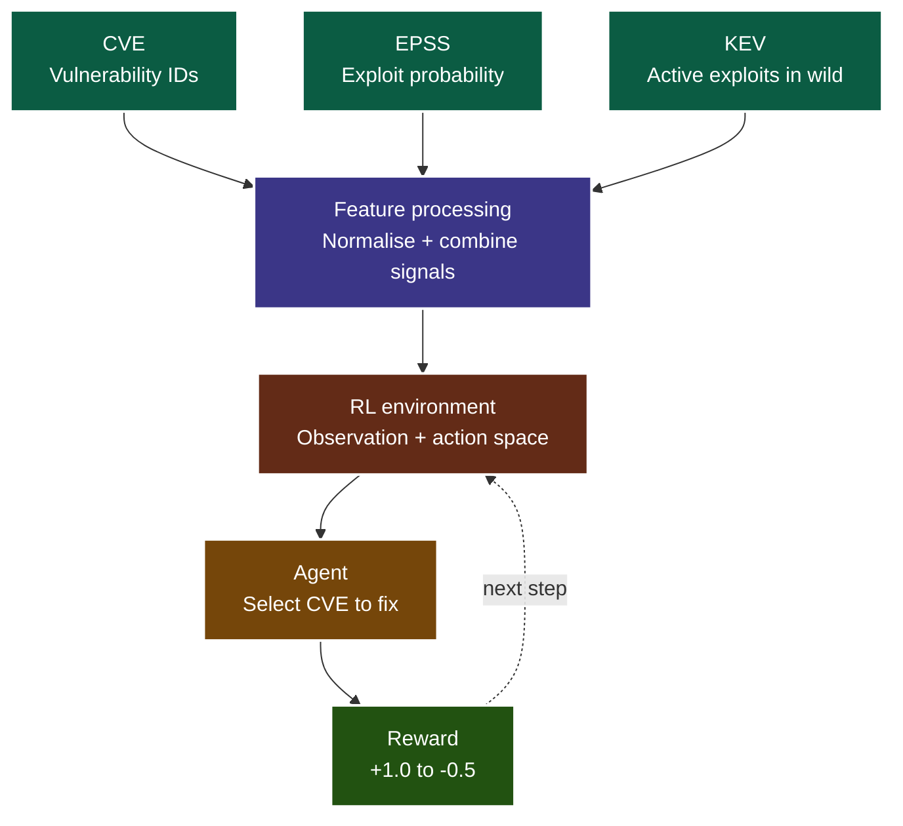
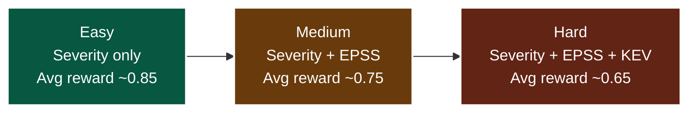

# Autonomous Cybersecurity Triage Environment using Reinforcement Learning

## What is this project?

Security teams today are buried under thousands of vulnerability alerts. Deciding which ones to fix first — and in what order — is one of the hardest and most consequential decisions a SOC analyst makes daily.

This project turns that problem into a **reinforcement learning challenge**. Instead of static scoring (rank everything by CVSS, done), an AI agent makes sequential decisions, learns from feedback, and improves its prioritization strategy over time — just like a seasoned analyst would.

The agent is grounded in real-world threat data: CVE identifiers, EPSS exploit probability scores, and CISA's Known Exploited Vulnerabilities (KEV) catalog.

---

## Why Reinforcement Learning?

Traditional vulnerability scanners spit out a ranked list. That's fine, but it doesn't capture the nuance of real triage: a low-severity bug actively being exploited in the wild matters more than a critical one that's theoretical. Context, likelihood, and asset value all interact.

RL handles this naturally. Each decision the agent makes affects its cumulative score, encouraging it to learn policies that reflect real-world risk — not just raw severity numbers.

---

## How the Environment Works



Each episode gives the agent a set of vulnerabilities to look at. It picks one per step, and can take up to **3 steps per episode**. Every choice earns or loses points based on how good that pick actually was.

The agent sees the following about each vulnerability:

- **CVE ID** — the unique identifier
- **Severity score** — the CVSS base score (impact potential)
- **EPSS score** — statistical likelihood of exploitation within 30 days
- **KEV flag** — whether it's already being actively exploited in real attacks
- **Asset criticality** — how important the affected system is to the organisation

The agent's job is to learn: given all of this, which vulnerability deserves attention *right now*?

---

## Reward Structure

Good decisions are rewarded, lazy or wrong ones are penalised. The reward table is designed to push the agent toward decisions that reflect real analyst judgment — not just "pick the highest CVSS":

| Decision quality | Reward |
|---|---|
| Best possible pick | +1.0 |
| Top 3 picks | +0.7 |
| Top 5 picks | +0.4 |
| Poor selection | -0.2 |
| Picking the same CVE twice | -0.3 |
| Invalid action | -0.5 |
| KEV bonus (actively exploited) | +0.2 |

The KEV bonus is intentional: a bug being exploited in the wild today is worth prioritising even if its raw score is only moderate.

---

## Difficulty Levels

The environment has three task difficulties, letting you train or test agents at increasing complexity:



The performance drop from Easy to Hard is expected — the harder tasks require the agent to balance competing signals rather than optimise a single metric.

---

## Project Structure

```text
env/
  security_env.py      # Core RL environment
  models.py            # Vulnerability data models

threat_intel/
  cve_loader.py        # CVE ingestion
  epss.py              # EPSS score fetching
  kev.py               # KEV catalog integration

core/
  scoring.py           # Reward calculation logic

api/
  server.py            # REST API interface

inference.py           # Run the agent
openenv.yaml           # Environment configuration
```

---

## Getting Started

**1. Clone the repo**
```bash
git clone https://github.com/Tharungowdapr/RL-Agent-for-Security.git
cd RL-Agent-for-Security
```

**2. Install dependencies**
```bash
pip install -r requirements.txt
```

**3. Set your credentials**
```bash
export API_BASE_URL=https://api.openai.com/v1
export MODEL_NAME=gpt-4.1-mini
export HF_TOKEN=your_api_key_here
```

**4. Run the agent**
```bash
python inference.py
```

**Sample output:**
```text
[START] task=easy env=security model=gpt-4.1-mini
[STEP] step=1 action=CVE-123 reward=0.70 done=false error=null
[STEP] step=2 action=CVE-456 reward=1.00 done=false error=null
[STEP] step=3 action=CVE-789 reward=0.40 done=true  error=null
[END]  success=true steps=3 rewards=0.70,1.00,0.40
```

---

## Training Your Own Agent

The environment is compatible with standard RL training frameworks. The `security_env.py` file exposes a standard `step()` / `reset()` interface, so you can plug in any of the following without modification:

- **PPO** (Proximal Policy Optimization) — stable and good for continuous reward environments
- **DQN** (Deep Q-Network) — straightforward for discrete action spaces like this one
- **Policy gradient methods** — if you want to experiment with custom reward shaping

The current baseline uses an LLM (`gpt-4.1-mini`) as the agent, which gives a useful benchmark for comparing against trained RL policies.

---

## Real-World Applications

This isn't just a research toy. The environment maps directly onto problems that SOC and vulnerability management teams face every day. With the right integration work, this approach could plug into:

- **Automated triage pipelines** — let the agent handle the first pass on a flood of new CVEs
- **Vulnerability management platforms** — as an intelligent scoring layer on top of raw scan results
- **Decision support tools** — surfacing the top 3–5 vulnerabilities that actually warrant attention today

---

## What's Next

- [ ] Train PPO and DQN agents and compare against the LLM baseline
- [ ] Add real-time CVE streaming so the environment stays current
- [ ] Model asset-specific risk (a vuln on a public-facing server ≠ an internal dev machine)
- [ ] Build a dashboard for SOC teams to inspect the agent's reasoning
